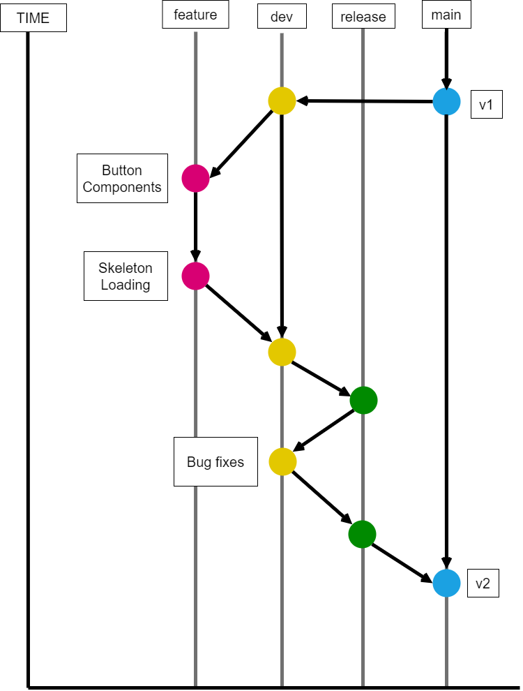
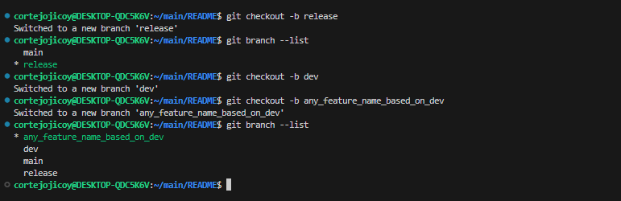

# Development Process

* [Test Driven Development](#test-driven-development)
* [Git Branching](#git-branching)

# Test Driven Development


### HOW IT WORKS!

1. `TEST FAILS` - Add a test, which will certainly FAIL

    - In TDD, every `functions`, `methods` and `components` in a software is first added in terms of test cases
    - Developers focus on the requirements before writing the code.
    - Run all the tests. See if any test fails

2. `TEST PASSES` - Write code 
    - add logical blocks to build the function

3. `REFACTOR` - Refactor the code
    - New code that might have been added for convenience to pass a test can be moved to its logical place in the code
    - Duplication must be eliminated
    - Object definitions and names must be set to represent their purpose and usage
    - As more features are added, functions become lengthy. It can prove beneficial to split and carefully named to improve readability and maintainability


# Git Branching


### HOW IT WORKS!

 * create new branches
    ```
    git checkout -b <branch_name>
    ```
* check branches list, refer to image above
    ```
    git branch -a
    ```
    ```
    git branch --all
    ```
    ```
    git branch --list
    ```

    * This would look like this

    

    * Whenever your about to create a new branches named after features your creating
    * Let just say, adding a new <strong>button components</strong> as well as <strong>skeleton loading</strong> was done

* based on image above; all **created feature** need to merge to `dev` branches
    ```
    git merge --no-ff <branch> -m <msg>
    ```
    > **NOTE** : refer to the [commit message docs](https://github.com/osea-dev/.github/blob/main/assets/docs/git_commits_message_format.md)

