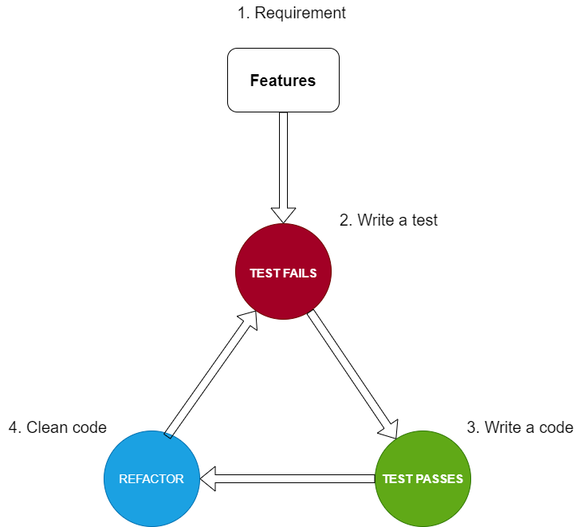
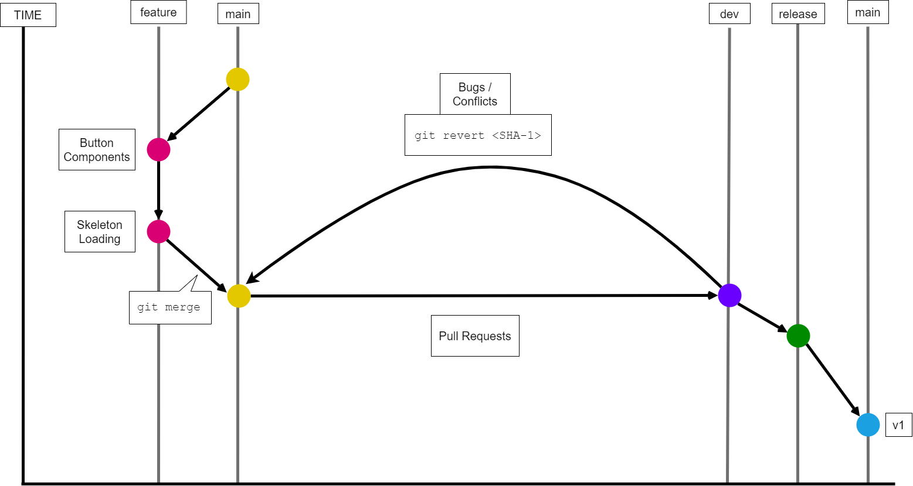
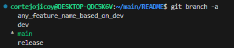

# Development Process

* [Test Driven Development](#test-driven-development)
* [Git Branching](#git-branching)

# Test Driven Development

### HOW IT WORKS!

1. `TEST FAILS` - Add a test, which will certainly FAIL

    - In TDD, every `functions`, `methods` and `components` in a software is first added in terms of test cases
    - Developers focus on the requirements before writing the code.
    - Run all the tests. See if any test fails

2. `TEST PASSES` - Write code 
    - add logical blocks to build the function

3. `REFACTOR` - Refactor the code
    - New code that might have been added for convenience to pass a test can be moved to its logical place in the code
    - Duplication must be eliminated
    - Object definitions and names must be set to represent their purpose and usage
    - As more features are added, functions become lengthy. It can prove beneficial to split and carefully named to improve readability and maintainability

# Git Branching

### HOW IT WORKS!

 * ### do `git checkout <options>`
    * using `-b` options will create new branch by adding `<branch_name>`
    * `git checkout -b <branch_name>`
    * without `-b` option will switch branch by adding `<branch_name>`
    * `git checkout <branch_name>`
    
* ### do `git branch <options>`
    * using `-a` or `--all` will display list of remote-tracking branches
    * `git branch -a`
    * `git branch --all`

        

    * Whenever your about to create a new branches named after features your creating
    * Let just say, adding a new <strong>button components</strong> as well as <strong>skeleton loading</strong> was done

>**NOTE**: `git merge` command is used by `git pull` to incorporate changes from another repository
* ### do `git merge <options>`
    * Let just say, **BUTTON COMPONENTS**, **SKELETON LOADING** `feature` was done; do merge
    * To merge:
        * switch branch to `main`
        * do `git merge --no-ff <feature_name> -m <msg>` refer to the [git commit message docs](https://github.com/osea-dev/.github/blob/main/assets/docs/git_commits_message_format.md)

    * using `--no-ff` options preserves the branch history and clearly indicates that a merge happened
    
* ### do `pull-request`

