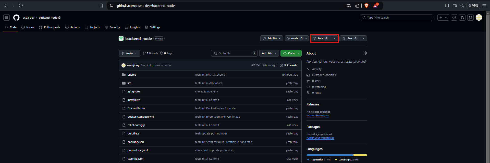
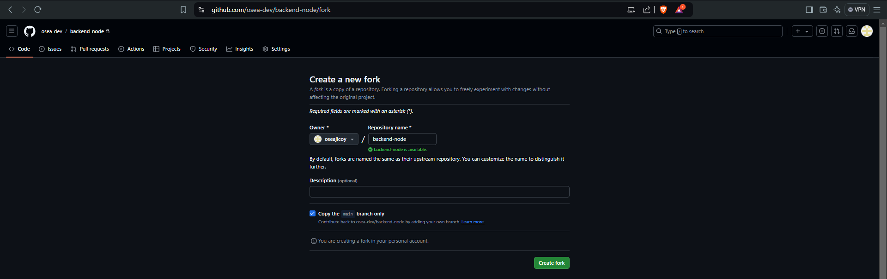
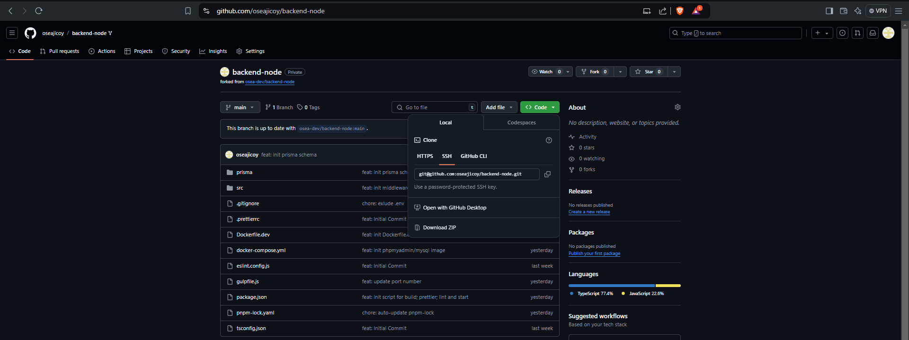

## Documentation

### Table of Contents
* [Prerequisites](#prerequisites)
* [Setup (Backend/Frontend)](#setup)
* [Getting Started](#getting_started)
* [Running the Application](#runapp)
* [Contributing](#contributing)
<!-- * [License](#license) -->


## Prerequisites

> **_NOTE:_** Before running the project, ensure you have the following tools installed.

1. `Ubuntu`
    * If you are using MacOS; kindly disregard this Ubuntu Installation setup.
    * Download and install `Ubuntu22.04.3 TLS` from `Microsoft Store`

2. `Docker`
    * Download and install Docker from [Docker official website](https://www.docker.com/products/docker-desktop/)
    * Verify the installation from terminal:
    ```
    docker --version
    ```
3. `IDE Terminal` Highly Recommend to use `VSCode`
    * Download and install VSCode from [Visual Studio Code official website](https://code.visualstudio.com/download)
    * Recommend extensions:
        * Prisma
        * Bracket Pair Color DLW
        * Docker
        * ESLint
        * Prettier ESLint
        * Vue - Official
        * *will add soon for best practices*

4. `Git`
    * Download and install Git for [Windows](https://git-scm.com/download/win) for [MacOS](https://git-scm.com/download/mac)
    * Configure SSH for GitHub:
        * Generate an SSH key
        ```
        ssh-keygen -t rsa -b 4096 -C "your_email@example.com"
        ```
        * Type `command` below to locate `ssh` folder
        ```
        cd ~/.ssh
        ```

        * Copy the public key 
        ```
        cat ~/.ssh/id_rsa.pub
        ```
    * Add SSH Key to your GitHub Account
        * Open [SSH and GPG keys](https://github.com/settings/keys) from GitHub Account
        * Click `New SSH key` button paste the copied `ssh keys` and add

## Setup

1. Fork the Repository

    * From main resource click the `Fork`
    
    * Then `Create Fork`
    
    * Copy the `SSH` link 
    


> **_NOTE:_** Create separate folder for backend & frontend


2. Clone the Repository

    * Clone the repository from your `Fork Repository`:
    ```
    git remote add <remote_name> <ssh_repository_link>
    ```
    * Verify the remote added:
    ```
    git remote -v
    ```
    * Pull the codes:
    ```
    git pull <remote_name> <branch_name>
    ```
    * If you encounter `error: failed to push some refs to` or `refspec does not match`   always check what branch you are:
    ```
    git branch -a
    ```
## Getting Started

1. Environment Variables

    * Create a copy from `.env.example`
    ```
    cp .env.example .env
    ```
2. Running Services

    * Start the app using Docker Compose:
    ```
    docker-compose up -d
    ```

## Contributing

> **_NOTE:_** This will cover codes contribution rules and best practices approach.

-  Naming Convention 
-  Code Format
-  Git Commits Message Format

