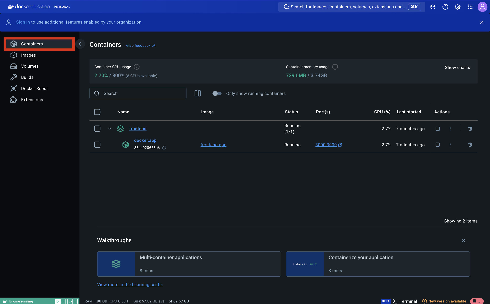

## Documentation

### Table of Contents
* [Prerequisites](#prerequisites)
* [Setup (Backend/Frontend)](#setup)
* [Getting Started](#getting-started)
* [Contributing](#contributing)
<!-- * [License](#license) -->


## Setup

> **_NOTE:_** Before running the project, ensure you have the following tools installed.

1. `Ubuntu`
    * If you are using MacOS; kindly disregard the Ubuntu Installation section.
    * Download and install `Ubuntu22.04.3 TLS` from `Microsoft Store`
    * Setup WSL2 for your system using this [guide from Microsoft](https://learn.microsoft.com/en-us/windows/wsl/install)

2. `Docker`
    * Create an account for Docker in [Docker official website](https://app.docker.com/signup?)
    * Download and install the version of Docker applicable for your system from [here](https://www.docker.com/products/docker-desktop/) 
    * Verify the installation from your terminal:
    ```
    docker --version
    ```

3. `IDE Terminal` - Highly recommended to use `VSCode`
    * Download and install VSCode from [Visual Studio Code official website](https://code.visualstudio.com/download)
    * Recommended extensions:
        * Docker
        * Bracket Pair Color DLW
        * Prisma
        * ESLint
        * Prettier ESLint
        * Vue - Official
        * Nuxtr 
        * *will add more soon for best practices*

4. `Git`
    * Download and install Git for [Windows](https://git-scm.com/download/win) or for [MacOS](https://git-scm.com/download/mac)
    * Configure SSH for GitHub using your terminal:
        * Generate an SSH key using your GitHub email
        ```
        ssh-keygen -t rsa -b 4096 -C "your_email@example.com"
        ```
        * Type the command below to locate the `ssh` folder
        ```
        cd ~/.ssh
        ```

        * Copy the public key after typing the command below (key usually begins with 'ssh-rsa')
        ```
        cat ~/.ssh/id_rsa.pub
        ```
    * Add the SSH Key to your GitHub Account
        * Open [SSH and GPG keys](https://github.com/settings/keys) from GitHub Account
        * Click `New SSH key` button and give the key a title of your choosing under Title
        * Paste the copied `ssh key` under Key
        * Click `Add SSH key`

#### The guidelines below are for node installation in MacOS using node version manager or nvm:

1. Install `Homebrew` from [here](https://brew.sh)

2. Copy the following into your terminal:
    
    ```
    export HOMEBREW_NO_INSTALL_FROM_API=1
    /bin/bash -c "$(curl -fsSL https://raw.githubusercontent.com/Homebrew/install/HEAD/install.sh)"
    ```
    Refer to the [documentations](https://docs.brew.sh/Installation) for why we are doing this or if you are experiencing issues with connecting to `GitHub.com`

3. Once `Homebrew` is installed, you can now install `nvm` refer to the command below:

    ```
    brew install nvm
    ```

    * Create a file using your terminal with
    ```
    nano ~/.zshrc
    ```
    * Copy the text below and paste it into your terminal (do NOT press enter after pasting)
    ```
        # Set up NVM (Node Version Manager)
        export NVM_DIR="$HOME/.nvm"

        # Load NVM
        if [ -s "/opt/homebrew/opt/nvm/nvm.sh" ]; then
        . "/opt/homebrew/opt/nvm/nvm.sh"  # This loads NVM
        fi

        # Load NVM bash completion (optional)
        if [ -s "/opt/homebrew/opt/nvm/etc/bash_completion.d/nvm" ]; then
        . "/opt/homebrew/opt/nvm/etc/bash_completion.d/nvm"  # This loads bash completion for NVM
        fi
    ```
    * Press <kbd>control</kbd> + <kbd>x</kbd>
    * Press <kbd>y</kbd>
    * Finally, hit <kbd>return</kbd>
    * Now we can run our file with
    ```
    source ~/.zshrc
    ```
4. Once `nvm` is installed, you can now install different versions of node: but we prefer to install `v18.20.4`
    ```
    nvm install 18.20.4
    ```

## Cloning

<!-- 
    1. Fork the Repository

    * From main resource click the `Fork`
    
    * Then `Create Fork`
    
    * Copy the `SSH` link 
     
-->


> **_NOTE:_** Create separate folders for your cloned repos


- Navigate to your desired folder and clone the desired repository

    * Copy the `SSH` link of desired repository
    

    * Clone the repository from the main repository:
    ```
    git clone <ssh_repository_link>
    ```
    * Navigate to repository directory:
    ```
    cd <repository_folder>
    ```
    * Verify the remote added:
    ```
    git remote -v
    ```
    * If you encounter `error: failed to push some refs to` or `refspec does not match` always check on which branch you are currently on:
    ```
    git branch -a
    ```

## Running the app

> **_NOTE:_** Highly recommended to put the frontend & backend folder under one folder as shown below
>
>```
>...
><folder_name>/
>--- frontend/
>--- backend/
>...
>```


1. Environment Variables

    * Create a copy from `.env.example`
    ```
    cp .env.example .env
    ```

2. Install Packages

    * Install `pnpm` globally:
    ```
    npm i -g pnpm
    ```

    * Install frontend/backend packages inside their folder:
    ```
    pnpm install 
    ```

2. Running Services

    * Start the app using Docker Compose:
    ```
    docker-compose up -d
    ```
    * Check if the app is running by going into Docker and selecting the `Containers` tab
    

    * Your app should now be running under the address provided by `Docker`
    


> **_NOTE:_** for backend you must do migrations.

4. Run the `command`:
    ```
    npx prisma migrate dev --name variable_name
    ```

## Contributing

> **_NOTE:_** This will cover the rules and best practices for contributing to the codebase.

-  Naming Convention 

    ## Frontend File-structure
    ```
    apps/
    └── frontend/
            ├── public/
            ├── components/
            |    └── .../
            ├── locales/
            |    ├── zh.json
            |    └── en_uk.json
            ├── pages/
            |    └── .../
            ├── src/
            |    └── .../
            └── test/
            app.vue
            nuxt.config.ts
            tsconfig.json
    packages/
    ├── eslint-config-custom/
    └── stylelint-config-custom/
    ...
    docker-compose.yml
    Dockerfile
    ```

    ## components
    - Singular 
    - Pascal Case
    - Encapsulate each component in folders

        #### ✅ Do This
        ```
        ...
        components/
            Block/
                ├── Block.vue
                └── Block.spec.ts
        ...
        ```

        #### ❌ Don't Do This
        ```
        ...
        components/
        ├── blocks.vue
        └── blocks.spec.ts
        ...
            cards/
                ├── card.vue
                └── card.spec.ts
            ...
        ...
        ```

    ## pages
    - Singular
    - Pascal Case
    - Encapsulate each page in folders

        #### ✅ Do This
        ```
        ...
        pages/
            sample/
                ├── Sample.vue
                └── Sample.spec.ts
                [...404].vue
        ...
        ```

        #### ❌ Don't Do This
        ```
        ...
        pages/
        ├── samplePages.vue
        └── samplePages.spec.ts
        ...
            samplePages/
                ├── samplePages.vue
                └── samplePages.spec.ts
        ...
        ```


-  [Git Commits Message Format](https://github.com/osea-dev/.github/blob/main/assets/docs/git_commits_message_format.md)
-  Schedule for Merging and Pull Requests
